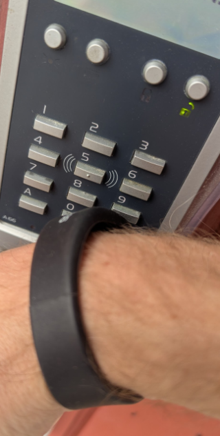

# mifare-uuid-to-axema-am

A simple script to get Axema AM code from Mifare Classic Tag UUID.

## WHY

Allow any Mifare Classic tag to become the means of open your Axema Controlled door. Don't pay extra for Axema branded tags.

## How does it work

The code simply removes the colon `:` from the uuid string and converts the full hexadecimal to decimal number.

## How do I get hold of the uuid / serial number

- Install a  NFC reader for your phone like https://play.google.com/store/apps/details?id=com.wakdev.wdnfc
- Get the uuid / serial number from your tag/card/bracelet/watch etc.

## Install

Simply replace the uuid variable with your own uuid and run
```pnpm install```
```pnpm dev```

## I don't know typescript and coding, what can I do?

It can be done without running this code – simply:

- Install a  NFC reader for your phone like https://play.google.com/store/apps/details?id=com.wakdev.wdnfc
- Get the uuid / serial number from your tag/card/bracelet/watch etc.
- Remove the colon `:` from the uuid / serial number.
- Add the value to https://www.rapidtables.com/convert/number/hex-to-decimal.html and convert it
- Add the resulting value to Axema Vaka Admin (extra tag).
  - It might need to be prefixed with 7 zeroes in Axema Vaka Admin, make sure to select the Mifare type.

## Real world example

In this example I use my gym-access bracelet.


